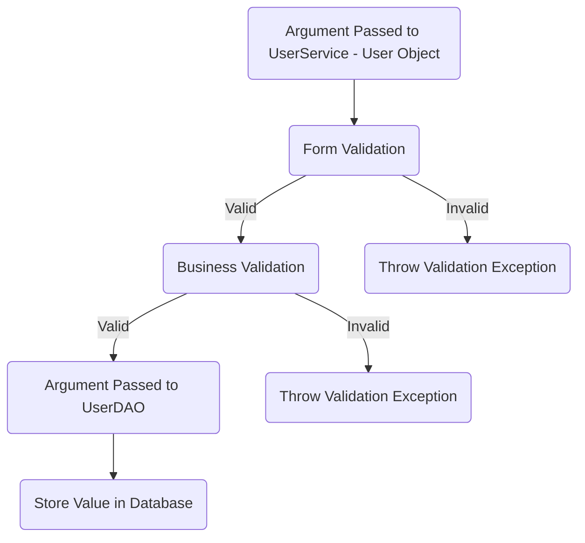
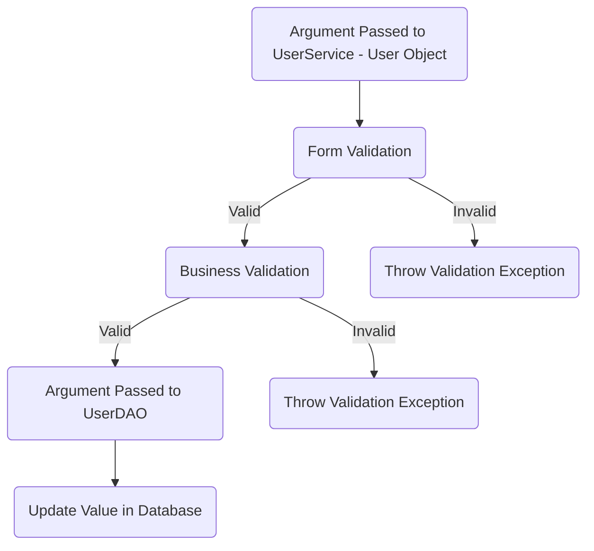
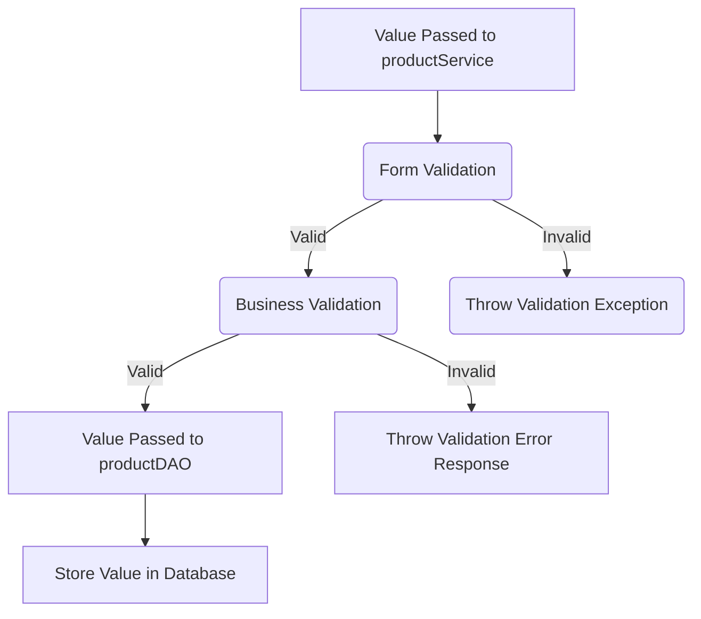
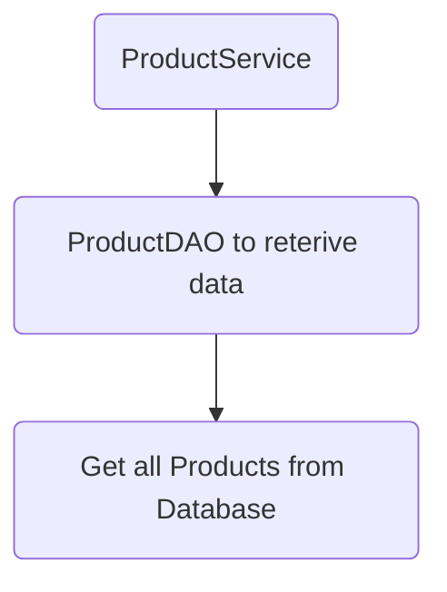
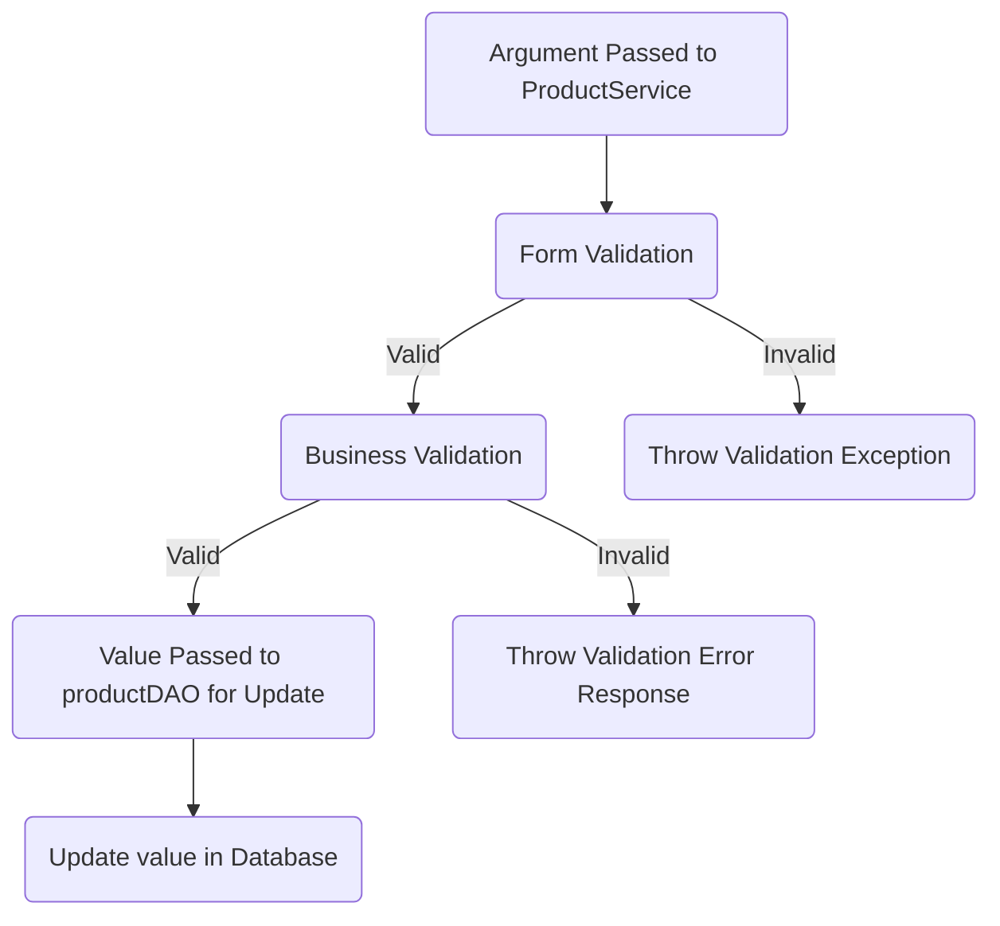
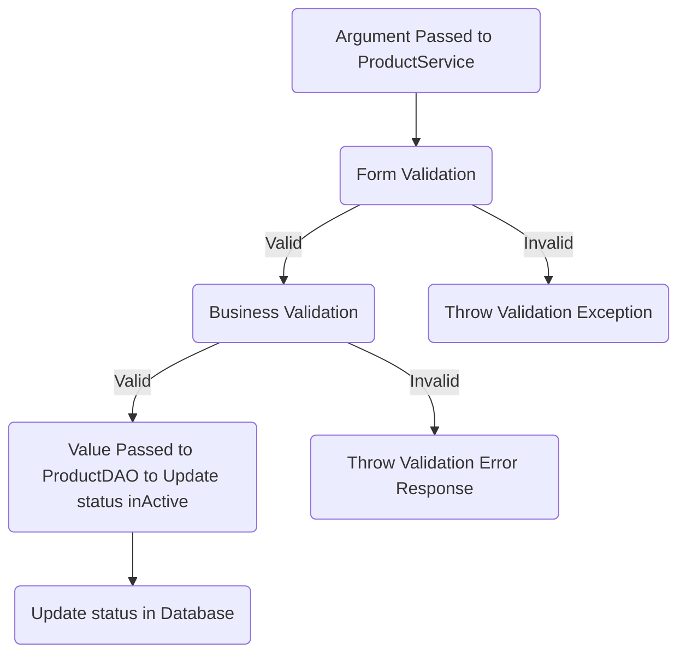
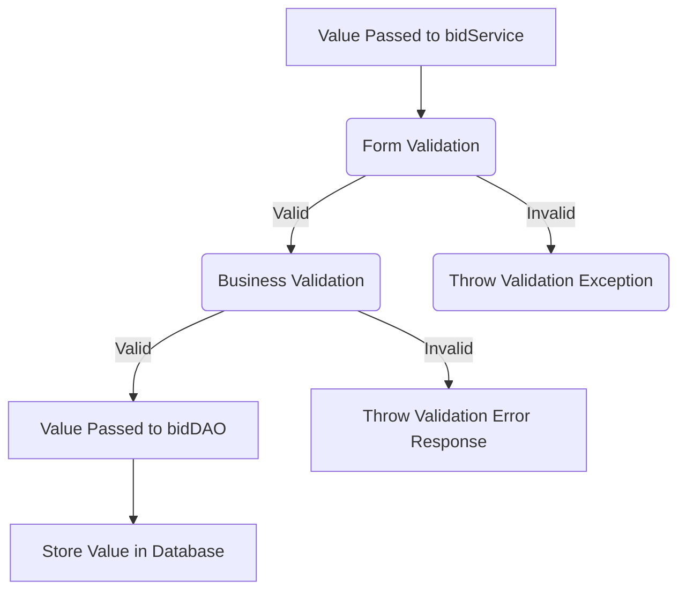
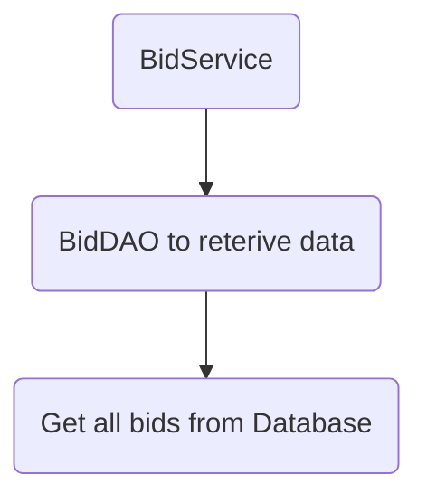

# VANHA  application Checklist

## Database Design

- [ ] ER diagram of the database: 
- [ ] Script for creating table : [script](/src/main/resources/db/migration/V1__create_products.sql)  

## Project Setup

- [ ] Create a new Java project
- [ ] Set up a MySQL database
- [ ] Add necessary libraries
	- [ ] JDBC, 
	- [ ] MySQL Connector, 
	- [ ] JUnit, 
	- [ ] Dot env

## Module: User
### Feature: Create User  
> The create user feature creates new users in the users table of the database.
#### Pre-requisites:
- [ ] Create user table
- [ ] Create user entity
- [ ] Create user model
- [ ] user DAO (create)
- [ ] user service
#### Validations:  
* Form Validation  
  * user null  
  * name ( null, empty, pattern )  
  * email ( null, empty, pattern )  
  * password ( null, empty, pattern )  
  * phone number ( length, >= 600000001 && <= 9999999999 ) 

* Business Validation  
   * Email Already exists
#### Messages:  
  * User cannot be null  
  * Name can't null or empty
  * Email can't null or empty
  * Password can't null or empty
  * Phone number can't null or empty
  * User already exists  
#### Flow:  
> Invalid When a user's email address is already in use or when the input provided does not meet the criteria, users arise.

### Feature: Update User  
> The update user feature update exists users in the users table of the database.
#### Pre-requisites:  
- [ ] Create user table
- [ ] User entity
- [ ] User model
- [ ] user DAO (update)
- [ ] user service 
#### Validations:  

* Form Validation  
     * User Object 
     * user null  
     * name ( null, empty, pattern )  
     * email ( null, empty, pattern )  
     * password ( null, empty, pattern )  
     * id ( <= 0 )  
     * phone number ( length, >= 600000001 && <= 9999999999 )  
* Business Validation  
   * user does exists or not
   * Status is active
#### Message:  

  * User cannot be null  
  * Name can't null or empty
  * Name doesn't match the pattern
  * Email can't null or empty
  * Email doesn't match the pattern
  * Password can't null or empty
  * Password doesn't match the pattern
  * Phone number can't null or empty
  * Id should above 0  
  * User doesn't exists  
 #### Flow:  
> Invalid Users occur when a user doesn't exist in the database or when the input provided doesn't meet the criteria.

## Module: Product
### Feature: Create new product  
> The create new product feature creates product in the products table of the database.
#### Pre-requisites:
- [ ] Create product table
- [ ] Create product entity
- [ ] Create product model
- [ ] product DAO (
- [ ] product service

#### Validations:  

* Form Validation  
   * product null  
   * name ( null, empty, pattern )  
   * category ( null, empty, pattern ) 
   * product id ( null, empty, pattern ) 
   * description ( null, empty ) 
   * status  ( null, empty ) 
   * used duration ( null, empty, pattern ) 
   * price (100000000< price >0)
   * min price (100000000< price >0)
   * id ( id > 0 ) 
   * used period (100 < price > 0)
   * seller id (seller id > 0)

* Business Validation  
  * name does exists or not
#### Message:  
  * product cannot be null  
  * Name can't null or empty
  * Category can't null or empty  
  * Product id can't null or empty
  * Description can't null or empty
  * Status can't null or empty
  * Used duration can't null or empty
  * Price should with in range of above 0 and below  100000000
  * min price should with in range of above 0 and below  100000000
  * Id should with in range of above 0
  * Used period should with in range of above 0 and below  100
  * Seller id should with in range of above 0
  * min price should below the quoted price
  * Product name already exists  
#### Flow: 

> Note: Invalid happen when the input provided does not meet the criteria.

### Feature: Find All Products
#### Pre-requisites:  
- [ ] Product table
- [ ] Product entity
- [ ] Product model
- [ ] Product Dao 
- [ ] Product service

 #### Flow:  

### Feature: Update Product details
#### Pre-requisites:  
- [ ] Product table
- [ ] Product entity
- [ ] Product model
- [ ] Product Dao
- [ ] Product service

#### Validations:  
* Form Validation 
     * product null  
     * name ( null, empty, pattern )  
     * description ( null, empty, pattern ) 
     * used duration ( null, empty, pattern ) 
     * product id ( null, empty, pattern ) 
     * price (100000000< price >0)
     * min price (100000000< price >0)
     * used period (100 < price > 0)
* Business Validation  
   * product does exists or not
   * Status is active
#### Message:  
  * product cannot be null  
  * Name can't null or empty
  * Product id can't null or empty
  * Description can't null or empty
  * Used duration can't null or empty
  * Price should with in range of above 0 and below  100000000
  * min price should with in range of above 0 and below  100000000
  * Id should with in range of above 0
  * Used period should with in range of above 0 and below  100
  *  min price should below the quoted price
  * Product does not exists
 #### Flow:  
> Invalid occur when a product doesn't exist in the database or  when the input provided doesn't meet the criteria.

### Feature: Delete product
#### Pre-requisites:  
- [ ] Product table
- [ ] Product entity
- [ ] Product model
- [ ] Product Dao
- [ ] Product service

#### Validations:  
- [ ] product validator 

 * Form Validation 
     * product Object 
     * product null  
     * product id ( null, empty, pattern ) 
* Business Validation  
   * product does exists or not
   * Status is active
 #### Message:  
  * product cannot be null  
  * Product id can't null or empty
  * Product does not exists
 #### Flow:  
> Invalid Users occur when a user doesn't exist in the database or  when the input provided doesn't meet the criteria.

## Module: Bidding
### Feature: Create new bid
> The create new bid feature creates bid in the bid_history table of the database.
#### Pre-requisites:
- [ ] Create bid_history table
- [ ] Create bid entity
- [ ] Create bid model
- [ ] bid DAO(create bid)  
- [ ] bid service (create(Bid bid) - 1 argument )

#### Validations:  

* Form Validation 
  * Bid Object 
     * bid ( null, empty )  
     * product id ( null, empty, pattern ) 
     * bid_date ( format ) 
     * bid_amount (100000000 > bid amount > minimum amount)
     * bid_id (bid_id > 0)
* Business Validation  
   * product does exists or not (name)
#### Message:  
  * Bid cannot be null  
  * Product id can't null or empty
  * Invalid date format  
  * Invalid password input 
  * Bided amount should be above the minimum amount and below 100000000
  * Bid_id should be above 0
  * product doesn't exists  
#### Flow: 

> Note: Invalid happen when the input provided does not meet the criteria.

### Feature: Find All Bids
#### Pre-requisites:  
- [ ] Bid table
- [ ] Bid entity
- [ ] Bid model
- [ ] Bid Dao(find all bids) 
- [ ] Bid service
#### Validations:  

 * Form Validation 
     * product id ( null, empty, pattern ) 
* Business Validation  
   * product does exists or not
 #### Message:  
  * Product id can't null or empty
  * Product does not exists
 #### Flow:  

