# VANHA  application Checklist

## Database Design

- [ ] ER diagram of the database: 
- [ ] Script for creating table : 

      * Create the "users" table

         CREATE TABLE users (
         id INT AUTO_INCREMENT PRIMARY KEY,
         username VARCHAR(100) NOT NULL,
         email VARCHAR(100) NOT NULL UNIQUE,
         number BIGINT NOT NULL,
         password VARCHAR(100) NOT NULL,
         location VARCHAR(100) NOT NULL,
         status BOOLEAN DEFAULT 1,
         created_at DATETIME,
         modified_at DATETIME
         );
         
      * Create the "asserts" table

         CREATE TABLE assets(
         id INT AUTO_INCREMENT PRIMARY KEY,
         url VARCHAR(255) NOT NULL
         ); 
         
      * Create the "products" table with foreign key to "users

         CREATE TABLE products (
         id INT AUTO_INCREMENT PRIMARY KEY,
         product_id VARCHAR(100) UNIQUE NOT NULL,
         category VARCHAR(2) NOT NULL,
         used_period INT,
         used_duration VARCHAR(2) NOT NULL,
         description TEXT,
         name VARCHAR(255) NOT NULL,
         price INT(10),
         min_price INT(10),
         seller_id INT,
         status CHAR,
         created_at DATETIME,
         modified_at DATETIME,
         FOREIGN KEY (seller_id) REFERENCES users(id)
         );
         
      * Create the "bid_history" table with foreign keys to "users" and "products"

          CREATE TABLE bid_history (
          id INT AUTO_INCREMENT PRIMARY KEY,
          bid_amount INT,
          bid_date DATETIME NOT NULL,
          buyer_id INT,
          product_id INT,
          status BOOLEAN DEFAULT 1,
          FOREIGN KEY (product_id) REFERENCES products(id)
          );
          
      * Create the "product_asserts" table with foreign keys to "products" and "asserts"

          CREATE TABLE product_assets(
          product_id INT,
          asset_id INT,
          status BOOLEAN DEFAULT 1,
          FOREIGN KEY (product_id) REFERENCES products(id),
          FOREIGN KEY (asset_id) REFERENCES assets(id)
          );
  

## Project Setup

- [ ] Create a new Java project
- [ ] Set up a MySQL database
- [ ] Add necessary libraries
	- [ ] JDBC, 
	- [ ] MySQL Connector, 
	- [ ] JUnit, 
	- [ ] Dot env

## Module: User
### Feature: Create User  
> The create user feature creates new users in the users table of the database.
#### Pre-requisites:
- [ ] Create user table
- [ ] Create user entity
- [ ] Create user model
- [ ] user DAO (create)
- [ ] user service
#### Validations:  
* Form Validation  
  * user null  
  * name ( null, empty, pattern )  
  * email ( null, empty, pattern )  
  * password ( null, empty, pattern )  
  * location ( null, empty, pattern )  
  * phone number ( length, >= 600000001 && <= 9999999999 ) 

* Business Validation  
   * Email Already exists
#### Messages:  
  * Invalid user input 
  * Name cannot be null or empty
  * Email cannot be null or empty
  * Password cannot be null or empty
  * Location cannot be null or empty
  * Invalid email length
  * Invalid password length
  * Invalid name length
  * Invalid location length
  * Invalid number input
  * Invalid email pattern
  * Invalid name pattern
  * Invalid password pattern
  * Invalid location pattern
  * User already exists
#### Flow:  
> Invalid When a user's email address is already in use or when the input provided does not meet the criteria, users arise.
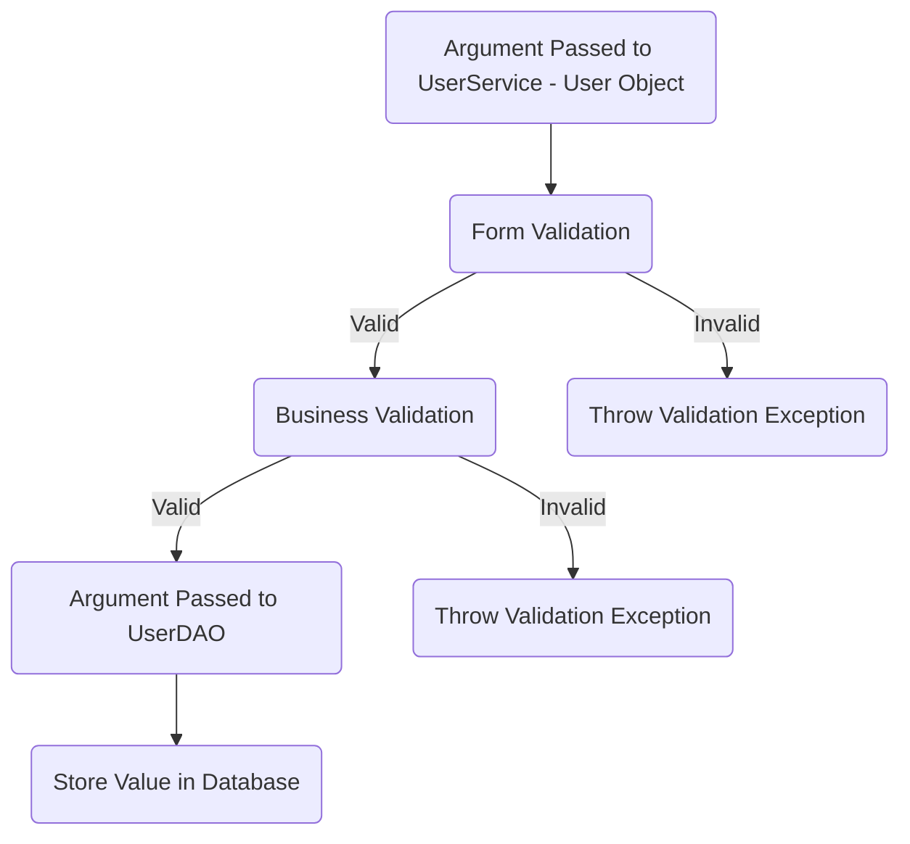
### Feature: Update User  
> The update user feature update exists users in the users table of the database.
#### Pre-requisites:  
- [ ] Create user table
- [ ] User entity
- [ ] User model
- [ ] user DAO (update)
- [ ] user service 
#### Validations:  

* Form Validation  
     * User Object 
     * user null  
     * name ( null, empty, pattern )  
     * email ( null, empty, pattern )  
     * password ( null, empty, pattern )  
     * Location ( null, empty, pattern )  
     * phone number ( length, >= 600000001 && <= 9999999999 )  
* Business Validation  
   * user does exists or not
   * Status is active
#### Message:  

  * Invalid user input
  *  Name cannot be null or empty
  * Email cannot be null or empty
  * Password cannot be null or empty
  * Location cannot be null or empty
  * Name cannot be null or empty
  * Location cannot be null or empty
  * Invalid number input
  * Invalid email pattern
  * Invalid name pattern
  * Invalid location pattern
  * User doesn't exists
 #### Flow:  
> Invalid Users occur when a user doesn't exist in the database or when the input provided doesn't meet the criteria.
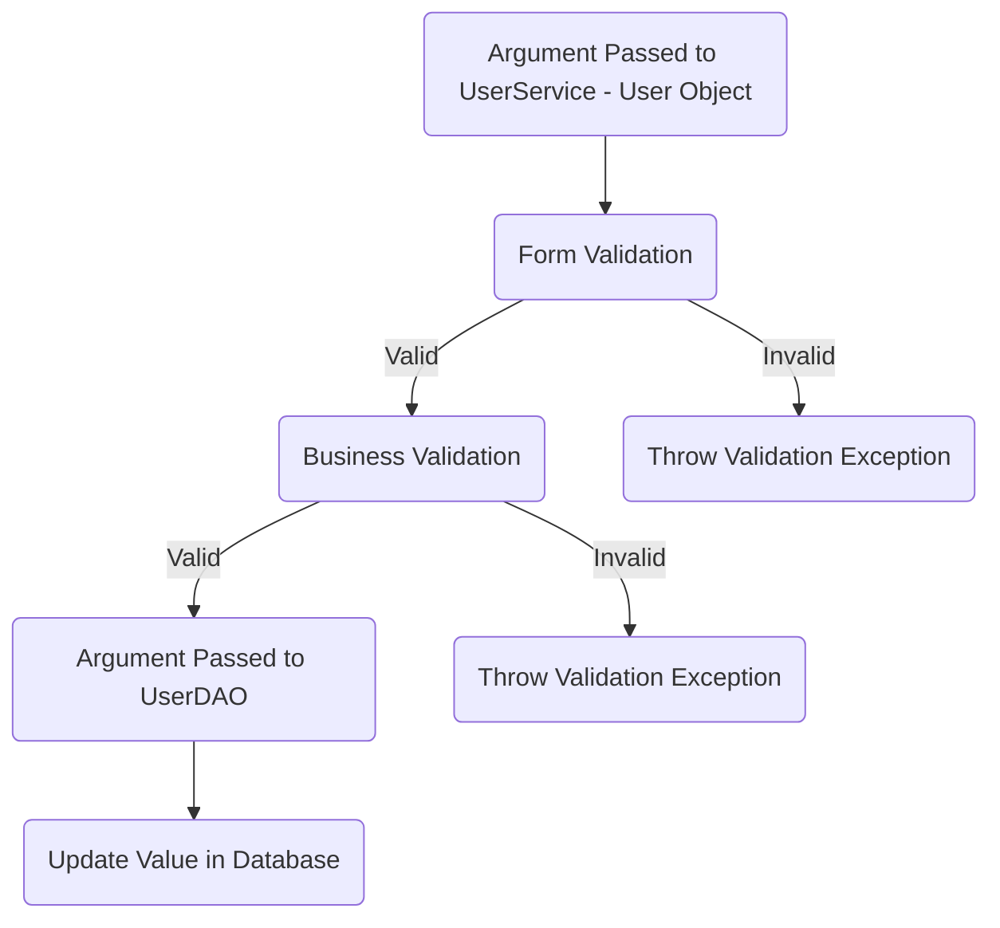
## Module: Product
### Feature: Create new product  
> The create new product feature creates product in the products table of the database.
#### Pre-requisites:
- [ ] Create product table
- [ ] Create product entity
- [ ] Create product model
- [ ] product DAO (
- [ ] product service

#### Validations:  

* Form Validation  
   * product null  
   * name ( null, empty, pattern )  
   * category ( null, empty, pattern ) 
   * product id ( null, empty, pattern ) 
   * seller id ( null, empty, pattern ) 
   * description ( null, empty ) 
   * used duration ( null, empty, pattern ) 
   * price (100000000< price >0)
   * min price (100000000< price >0) 
   * used period (100 < price > 0)

* Business Validation  
  * name does exists or not
#### Message:  
  * Invalid product input
  * Product Id can't null or empty
  * Name can't null or empty  
  * Description can't null or empty
  * Invalid product id length
  * Invalid category length
  * Invalid used duration length
  * Invalid name length
  * Price should between the limit 1 - 100000000
  * Price should between the limit 1 - 100000000
  * Minimum amount price should be lesser than price
  * Used period should between the limit 1 - 100
  * Product already exists
  * User already exists
#### Flow: 

> Note: Invalid happen when the input provided does not meet the criteria.

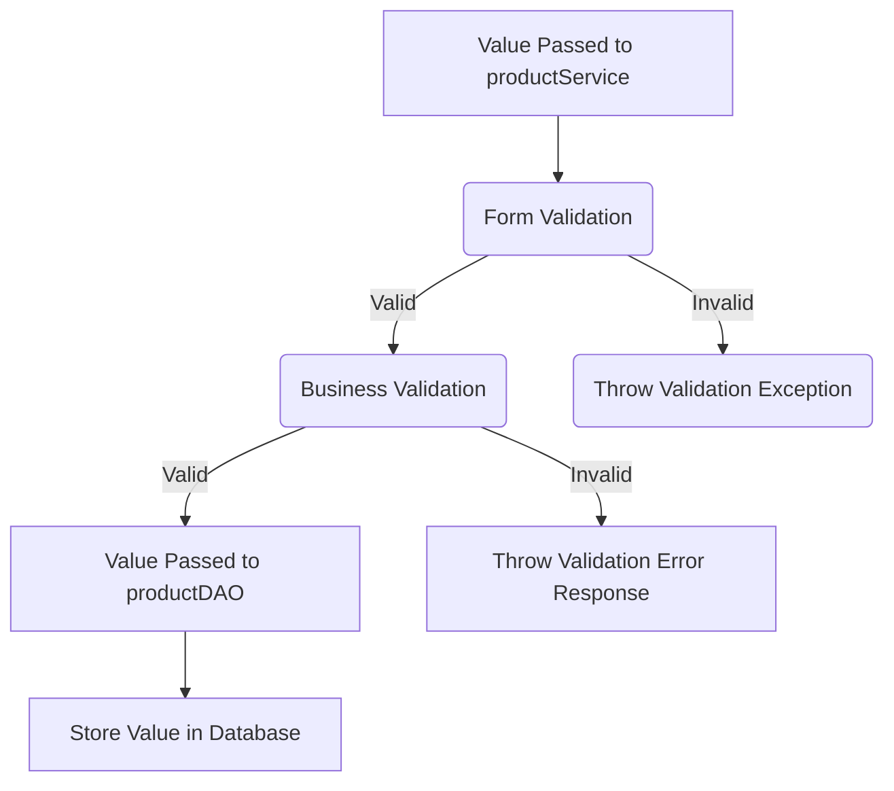
### Feature: Find All Products using User Id
#### Pre-requisites:  
- [ ] Product table
- [ ] Product entity
- [ ] Product model
- [ ] Product Dao 
- [ ] Product service

#### Validations: 
* Form Validation 
      * User ID ( null, empty ) 
#### Message:  
  * User ID can't null or empty

 #### Flow:  
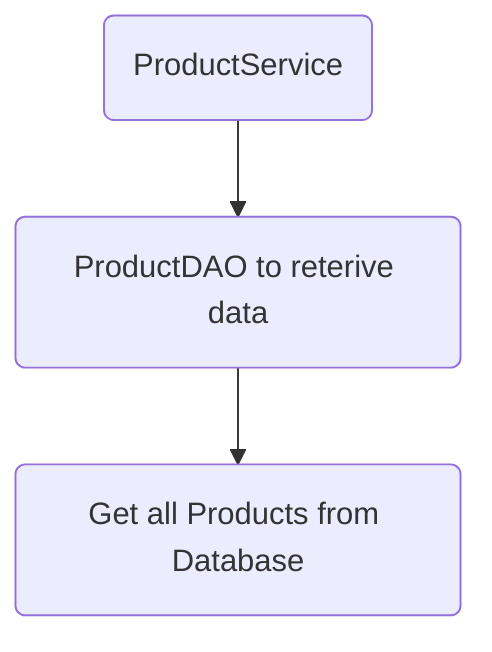
### Feature: Update Product details
#### Pre-requisites:  
- [ ] Product table
- [ ] Product entity
- [ ] Product model
- [ ] Product Dao
- [ ] Product service

#### Validations:  
* Form Validation 
     * product null  
     * name ( null, empty, pattern )  
     * description ( null, empty, pattern ) 
     * used duration ( null, empty, pattern ) 
     * product id ( null, empty, pattern ) 
     * price (100000000< price >0)
     * min price (100000000< price >0)
     * used period (100 < price > 0)
* Business Validation  
   * product does exists or not
   * Status is active
#### Message:  
  * Invalid product input
  * Name can't null or empty
  * Product id can't null or empty
  * Description can't null or empty
  * Used duration can't null or empty
  * Invalid used duration length
  * Price should between the limit 1 - 100000000
  * Used period should between the limit 1 - 100
  * product doesn't exists
 #### Flow:  
> Invalid occur when a product doesn't exist in the database or  when the input provided doesn't meet the criteria.
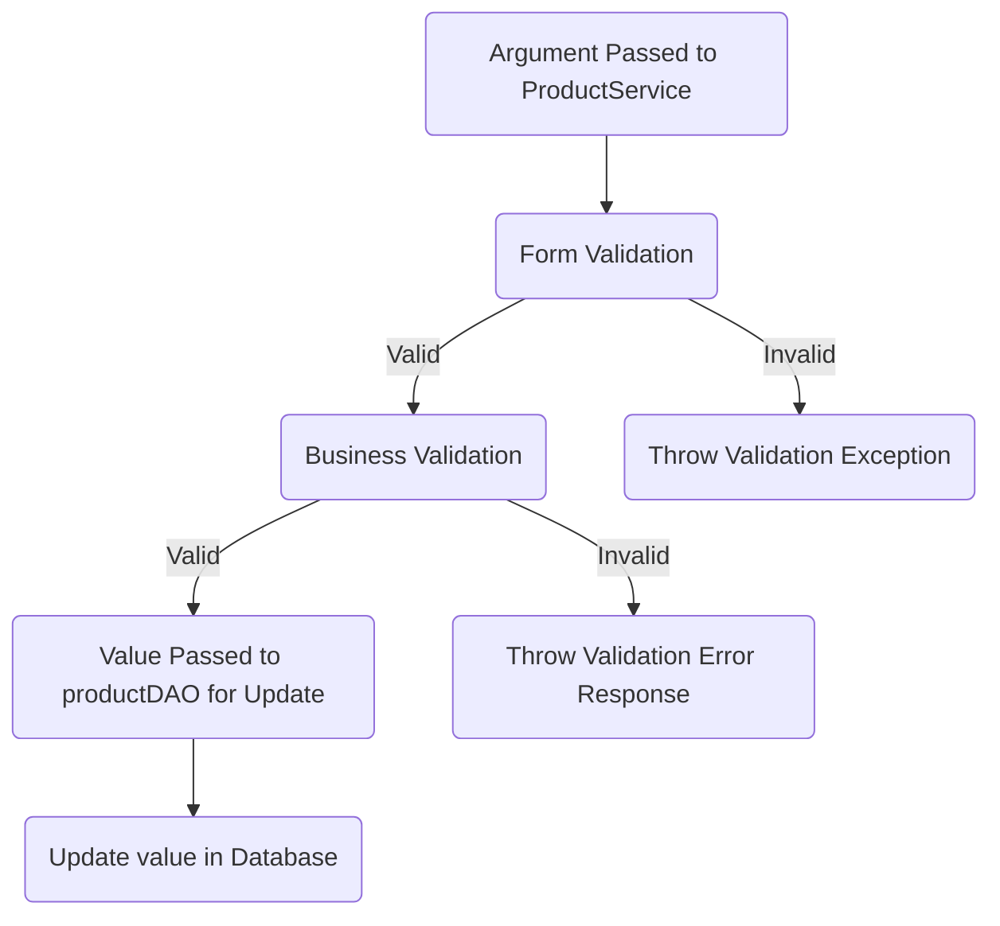
### Feature: Delete product
#### Pre-requisites:  
- [ ] Product table
- [ ] Product entity
- [ ] Product model
- [ ] Product Dao
- [ ] Product service

#### Validations:  
- [ ] product validator 

 * Form Validation 
     * product id ( null, empty, pattern ) 
* Business Validation  
   * product does exists or not
 #### Message:  
  * Product id can't null or empty
  * Product doesn't exists
 #### Flow:  
> Invalid Users occur when a user doesn't exist in the database or  when the input provided doesn't meet the criteria.
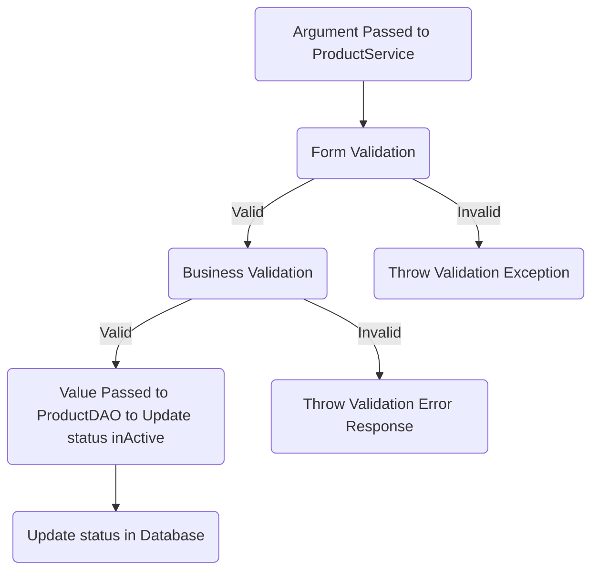
### Feature: Find All Products using Category
#### Pre-requisites:  
- [ ] Product table
- [ ] Product entity
- [ ] Product model
- [ ] Product Dao 
- [ ] Product service

#### Validations: 
* Form Validation 
      * category ( null, empty, pattern) 
#### Message:  
  * Category can't null or empty
  * Input category does not match any of the four options.

 #### Flow:  

## Module: Bidding
### Feature: Create new bid
> The create new bid feature creates bid in the bid_history table of the database.
#### Pre-requisites:
- [ ] Create bid_history table
- [ ] Create bid entity
- [ ] Create bid model
- [ ] bid DAO(create bid)  
- [ ] bid service (create(Bid bid) - 1 argument )

#### Validations:  

* Form Validation 
  * Bid Object 
     * bid ( null, empty )  
     * product id ( null, empty, pattern ) 
     * bid_amount (100000000 > bid amount > minimum amount)
     * seller id ( null, empty, pattern ) 
* Business Validation  
   * product does exists or not (name)
#### Message:  
  * Bid input cannot be null
  * Product id can't null or empty
  * Bidded amount should be with in the limit of 1 - 100000000
  * Bidded amount is lesser than minimum amount
  * Buyer Id cannot be same as Seller Id
  * Invalid Buyer Id
  * Buyer not found in user table
#### Flow: 

> Note: Invalid happen when the input provided does not meet the criteria.

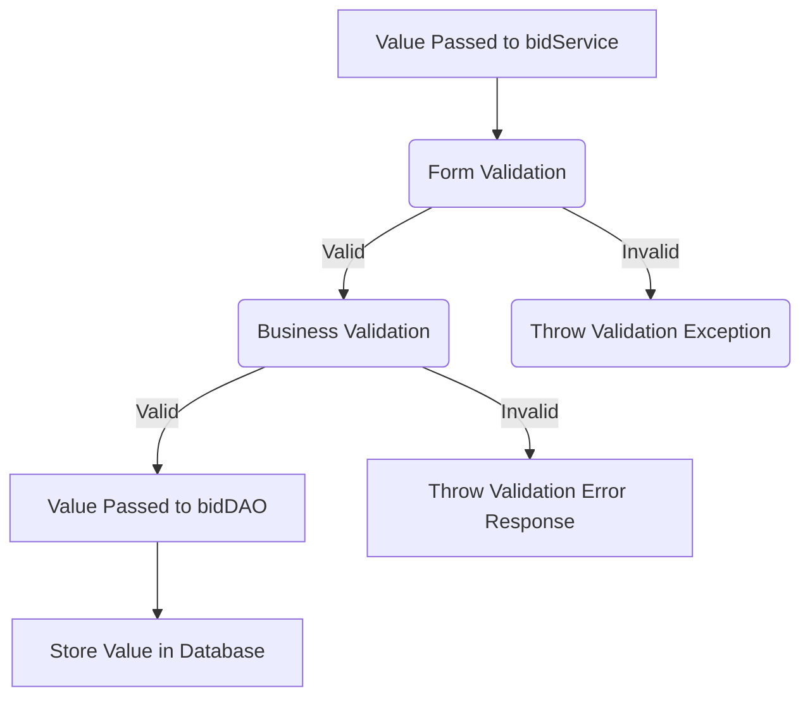
### Feature: Find All Bids
#### Pre-requisites:  
- [ ] Bid table
- [ ] Bid entity
- [ ] Bid model
- [ ] Bid Dao(find all bids) 
- [ ] Bid service
#### Validations:  

 * Form Validation 
     * product id ( null, empty, pattern ) 
* Business Validation  
   * product does exists or not
 #### Message:  
  * Product id can't null or empty
  * Product does not exists
 #### Flow:  
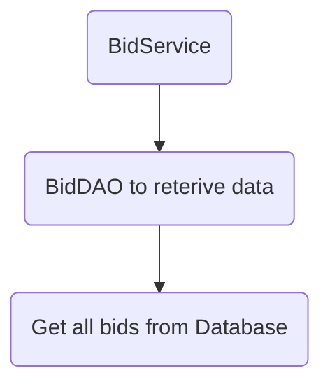
## Module: Assets
### Feature: Create Asset
> The create asset feature creates new asset in the asset table of the database.
#### Pre-requisites:
- [ ] Create asset table
- [ ] Create asset entity
- [ ] Create asset model
- [ ] asset DAO (create)
- [ ] asset service
#### Validations:  
* Form Validation  
  * url( null, empty, pattern )  
#### Messages:  
  * Asset cannot be null or empty
  * Invalid url pattern
#### Flow:  
> Invalid occur When a asset  does not meet the criteria, asset arise.
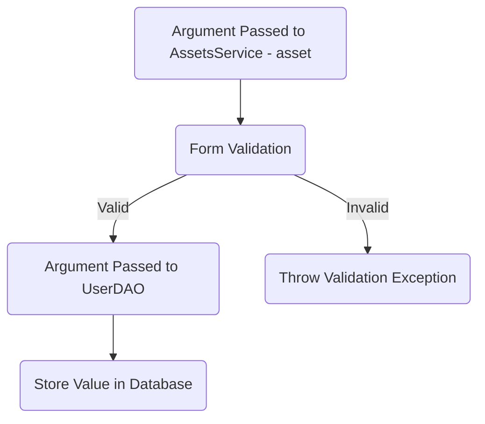
### Feature: Find All Assets
#### Pre-requisites:  
- [ ] assets table
- [ ] products table
- [ ] product_assert table
- [ ] asset entity
- [ ] product entity
- [ ] asset model
- [ ] product model
- [ ] asset Dao(find all asset) 
- [ ] asset service
#### Validations:  

 * Form Validation 
     * product id ( null, empty) 
     * asset id ( null, empty) 
* Business Validation 
   *  product does exists or not
 #### Message:  
  * product Id cannot be null or empty
  * asset Id cannot be null or empty
  * Product does not exists
 #### Flow:  
 > Invalid occur When a asset  does not meet the criteria or product does not exists, asset arise.
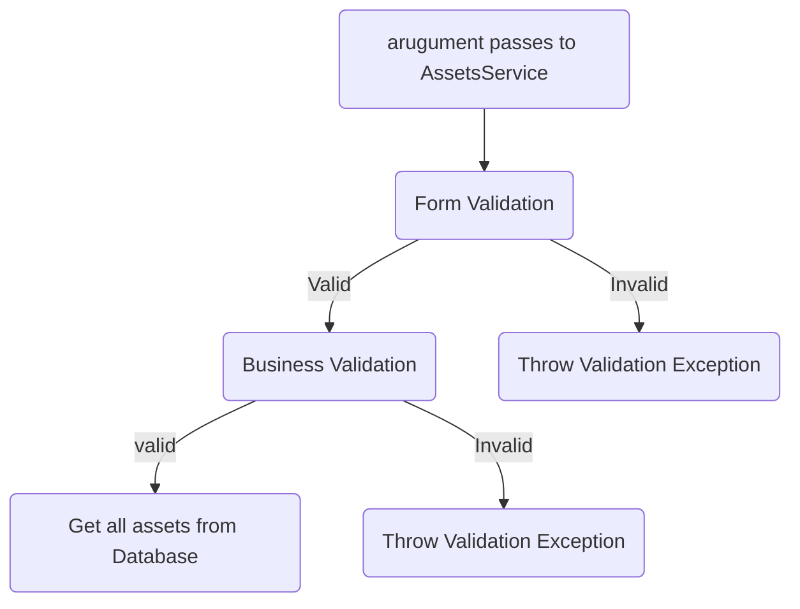

### Feature: Update Asset
> The update asset feature updates the asset that already exists in tha asset table of the database.
#### Pre-requisites:
- [ ] asset table
- [ ] asset entity
- [ ] asset model
- [ ] asset DAO (update)
- [ ] asset service
- [ ] product asset table
#### Validations:  
* Form Validation  
  * old url( null, empty) 
  * new url( null, empty, pattern )  
  * product id ( null, empty)  
* Business Validation 
   *  product does exists or not
   * old asset does exists or not
#### Messages:  
  * Old Asset value cannot be null or empty
  * New Asset value cannot be null or empty
  * Product id cannot be null or empty
  * Invalid url pattern of new asset
  * Product does not exists
  * Old asset does not exists
  * Old asset and new asset cannot be same
#### Flow:  
> Invalid occur When a asset  does not meet the criteria and old asset and new asset are same.
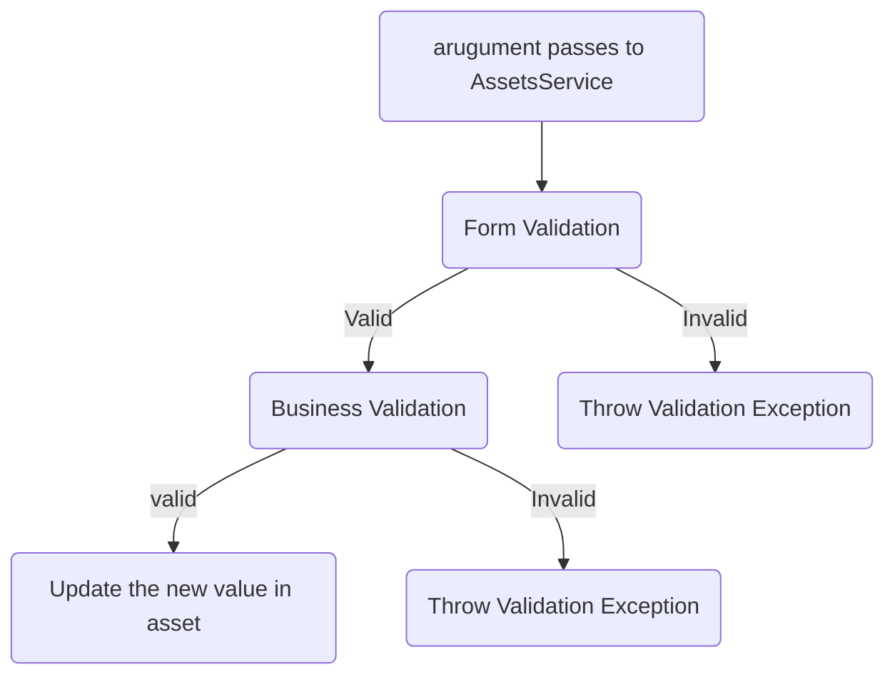
